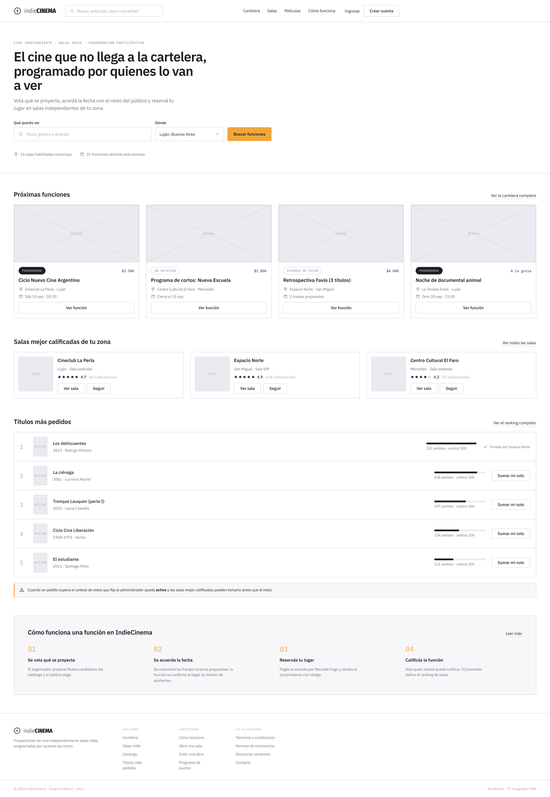

# Entrega 2 — Wireframes, arquitectura y modelo de objetos

Segunda de las cuatro entregas del Trabajo Práctico Integrador de **Programación en Ambiente
Web** (11086 — UNLu). Fecha de entrega: 14/09.

## Qué pide la entrega

- Los **wireframes** del sitio, cubriendo las vistas y flujos clave de la plataforma.
- La **definición de la arquitectura**, detallando la interacción entre cliente, servidor y servicios externos, la división en subsistemas y la estrategia de despliegue.
- El **diseño del modelo de objetos** del back-end y las consideraciones de **seguridad** por capa y por etapa del ciclo de vida.

## Arquitectura y modelo de objetos

Para esta etapa se definieron las bases estructurales y técnicas de **IndieCinema**:

- **Cinco subsistemas independientes**: La solución se divide en `programacion` (catálogo, salas, cartelera y votaciones), `cuentas` (usuarios, autenticación y perfiles), `funciones` (acuerdos de fecha, reservas y cobros), `moderacion` (admisión de salas y denuncias) y `Beneficios` (reparto, puntos y cupones). Cada subsistema corre como una aplicación MVC en PHP 8 en su propio contenedor Docker.
- **Despliegue y comunicación**: Un proxy inverso **nginx** gestiona el acceso público, valida sesiones y enruta el tráfico por prefijo de URL. La comunicación inter-subsistema se realiza mediante **APIs internas HTTP/JSON** (rutas privadas bajo `/interno/`) y **vistas SQL de sólo lectura** (`v_*`) sobre una base de datos **MySQL 8** compartida pero con esquemas y credenciales aisladas bajo el principio de mínimo privilegio.
- **División de repositorios**: Se estructura en dos repositorios: `indiecinema-front` (paquete Composer con plantillas Twig, estilos CSS y JS vanilla interactivo) e `indiecinema-back` (monorepo con Docker Compose, configuración de nginx, scripts de base de datos y los 5 subsistemas).
- **Modelo de objetos de dominio**: Clases con propiedad unívoca por subsistema, identificadores UUID desacoplados, estados gestionados con enumeraciones y métodos orientados al dominio del negocio.
- **Servicios externos y seguridad**: Integración con **Mercado Pago** (Checkout Pro y webhooks con verificación de firma e idempotencia) y **SMTP**. Controles de seguridad detallados por capa (red, sistema operativo, base de datos y aplicación) y consideraciones de seguridad en el diseño del ciclo de vida.

## Wireframes

Se diseñaron los wireframes para las 13 vistas y flujos principales de la aplicación:

| Pantalla | Archivo | Descripción |
| --- | --- | --- |
| **Home** | [`Wireframes/Home.png`](Wireframes/Home.png) | Portada principal con cartelera destacada, salas populares y accesos directos |
| **Cartelera** | [`Wireframes/Cartelera.png`](Wireframes/Cartelera.png) | Exploración y filtros de funciones, fechas, salas y géneros |
| **Sala Indie** | [`Wireframes/sala-indie.png`](Wireframes/sala-indie.png) | Perfil de sala, información técnica, cartelera y seguidos |
| **Ficha de película** | [`Wireframes/ficha-pelicula.png`](Wireframes/ficha-pelicula.png) | Detalle de obra audiovisual, sinopsis y funciones asociadas |
| **Función programada** | [`Wireframes/funcion-programada.png`](Wireframes/funcion-programada.png) | Vista de función con fecha y hora confirmadas |
| **Votación de título** | [`Wireframes/funcion-votacion-titulo.png`](Wireframes/funcion-votacion-titulo.png) | Interfaz para que los espectadores voten qué título proyectar |
| **Acuerdo de fecha** | [`Wireframes/funcion-acuerdo-de-fecha.png`](Wireframes/funcion-acuerdo-de-fecha.png) | Negociación y confirmación de franjas horarias entre sala y organizador |
| **Reserva y pago** | [`Wireframes/reserva-pago-comprobante.png`](Wireframes/reserva-pago-comprobante.png) | Selección de cupo, pasarela de pago y comprobante de reserva |
| **Mi cuenta** | [`Wireframes/mi-cuenta-reservas.png`](Wireframes/mi-cuenta-reservas.png) | Panel de usuario con historial de reservas y salas seguidas |
| **Panel de organizador** | [`Wireframes/panel-organizador.png`](Wireframes/panel-organizador.png) | Gestión de funciones, propuestas y administración de eventos |
| **Solicitud de sala** | [`Wireframes/solicitud-de-sala.png`](Wireframes/solicitud-de-sala.png) | Formulario de postulación y carga de documentación de salas |
| **Moderación** | [`Wireframes/moderacion-solicitudes.png`](Wireframes/moderacion-solicitudes.png) | Panel de moderación y aprobación de salas y documentación |
| **Administración** | [`Wireframes/administracion-usuarios-parametros.png`](Wireframes/administracion-usuarios-parametros.png) | Gestión de usuarios, roles y parámetros globales del sistema |

## Archivos

| Archivo | Descripción |
| --- | --- |
| [`Entrega_2.pdf`](Entrega_2.pdf) | Documento completo de la entrega (arquitectura, modelo de objetos y seguridad) |
| [`Wireframes/`](Wireframes/) | Directorio con los wireframes exportados de la aplicación |
| [Diagrama de Arquitectura (Draw.io)](https://drive.google.com/file/d/1AQqtOWbPA1VYGsZCJ0kpSpm-PVMIR3i8/view?usp=sharing) | Diagrama de componentes, interacción y despliegue |
| [Diagrama de Clases (Mermaid)](https://mermaid.ai/d/90896f9b-309b-4746-84d3-f3b2270a9706) | Modelo de objetos de dominio del back-end |

## Integrantes — Grupo Cerberus

- Salvador Baez
- Mateo Nomico
- Tomás Resnik
